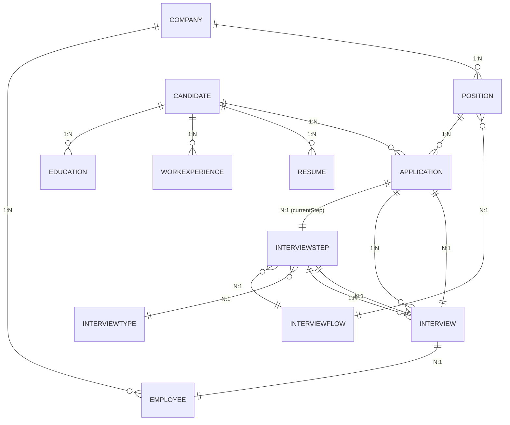
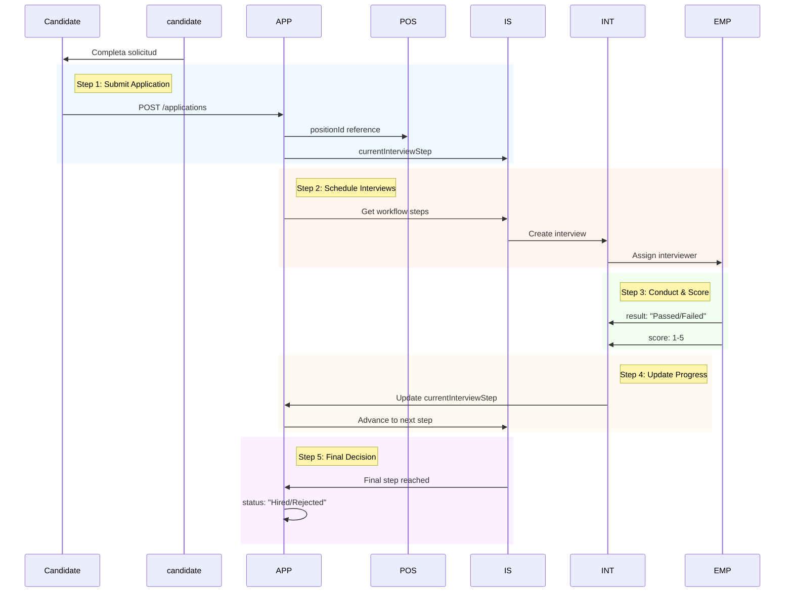
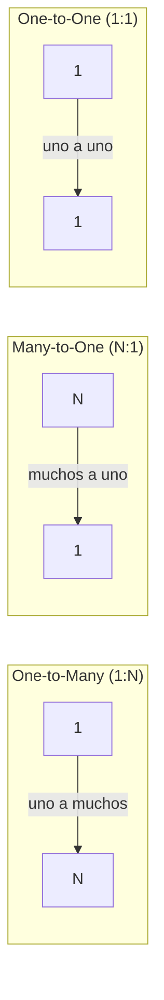

# Database Architecture - LTI Talent Tracking System

> Análisis detallado del archivo `schema.prisma` - Sistema de Gestión de Reclutamiento (ATS)

---

## 1. Entidades Modeladas

El schema define **11 modelos** que representan un sistema ATS completo:

| Modelo | Propósito | Campos Clave |
|--------|-----------|--------------|
| **Candidate** | Candidatos/as a ofertas | id, firstName, lastName, email, phone, address |
| **Education** | Formación académica | institution, title, startDate, endDate |
| **WorkExperience** | Experiencia laboral | company, position, description, startDate, endDate |
| **Resume** | Currículums vitae | filePath, fileType, uploadDate |
| **Company** | Empresas contratantes | name |
| **Employee** | Empleados/reclutadores | name, email, role, isActive |
| **Position** | Ofertas/vacantes | title, description, status, isVisible, location, salaryMin/Max |
| **Application** | Postulaciones (entidad asociativa) | applicationDate, currentInterviewStep, notes |
| **Interview** | Entrevistas programadas | interviewDate, result, score, notes |
| **InterviewStep** | Pasos del flujo de entrevista | name, orderIndex |
| **InterviewFlow** | Flujos de entrevista | description |
| **InterviewType** | Tipos de entrevista | name, description |

---

## 2. Diagrama Entidad-Relación (Mermaid)

### 2.1 ER Diagram - Notación Estándar



### 2.2 Modelo de Datos - Grafico Detallado

```mermaid
graph TB
    subgraph "=== CANDIDATE DOMAIN ==="
        C[Candidate<br/>- id: Int<br/>- firstName: String<br/>- lastName: String<br/>- email: String(Unique)<br/>- phone: String?<br/>- address: String?]
        E[Education<br/>- id: Int<br/>- institution: String<br/>- title: String<br/>- startDate: DateTime<br/>- endDate: DateTime?]
        W[WorkExperience<br/>- id: Int<br/>- company: String<br/>- position: String<br/>- description: String?<br/>- startDate: DateTime<br/>- endDate: DateTime?]
        R[Resume<br/>- id: Int<br/>- filePath: String<br/>- fileType: String<br/>- uploadDate: DateTime]
    end
    
    subgraph "=== COMPANY DOMAIN ==="
        CO[Company<br/>- id: Int<br/>- name: String(Unique)]
        EM[Employee<br/>- id: Int<br/>- name: String<br/>- email: String(Unique)<br/>- role: String<br/>- isActive: Boolean]
    end
    
    subgraph "=== POSITION DOMAIN ==="
        P[Position<br/>- id: Int<br/>- title: String<br/>- description: String<br/>- status: String<br/>- isVisible: Boolean<br/>- location: String<br/>- salaryMin: Float?<br/>- salaryMax: Float?]
        IF[InterviewFlow<br/>- id: Int<br/>- description: String?]
        IT[InterviewType<br/>- id: Int<br/>- name: String<br/>- description: String?]
        IS[InterviewStep<br/>- id: Int<br/>- name: String<br/>- orderIndex: Int]
    end
    
    subgraph "=== APPLICATION DOMAIN ==="
        A[Application<br/>- id: Int<br/>- applicationDate: DateTime<br/>- currentInterviewStep: Int<br/>- notes: String?]
        I[Interview<br/>- id: Int<br/>- interviewDate: DateTime<br/>- result: String?<br/>- score: Int?<br/>- notes: String?]
    end
    
    C --> E
    C --> W
    C --> R
    C --> A
    
    CO --> EM
    CO --> P
    
    P --> A
    IF --> IS
    IT --> IS
    
    A --> IS
    A --> I
    I --> EM
    I --> IS
```

### 2.3 Diagrama de Flujo - Ciclo de Vida de Aplicación



---

## 3. Relaciones entre Entidades

### 3.1 Estructura Jerárquica

```
Company (1) ──────────── (N) Employee
  │
  └── (N) Position
           │
           └── (N) Application ──────────── (1) Candidate
                    │                              │
                    │                              ├── (N) Education
                    │                              ├── (N) WorkExperience  
                    │                              └── (N) Resume
                    │
                    └── (N) InterviewStep (currentInterviewStep)
                               │
                               └── (N) Interview
                                        │
                                        └── (1) Employee
```

### 3.2 Relaciones Adicionales

| Desde | Hacia | Tipo | Descripción |
|-------|-------|------|-------------|
| `InterviewStep` | `InterviewFlow` | N:1 | Cada paso pertenece a un flujo |
| `InterviewStep` | `InterviewType` | N:1 | Cada paso tiene un tipo |
| `Position` | `InterviewFlow` | N:1 | Cada posición usa un flujo |
| `Interview` | `InterviewStep` | N:1 | Cada entrevista es de un paso |
| `Interview` | `Application` | N:1 | Cada entrevista pertenece a una app |

---

## 4. Claves Foráneas por Modelo

| Modelo | Campo FK | Relación con | Campo PK | Obligatoria |
|--------|----------|---------------|----------|-------------|
| **Education** | `candidateId` | → Candidate | `id` | ✅ SÍ |
| **WorkExperience** | `candidateId` | → Candidate | `id` | ✅ SÍ |
| **Resume** | `candidateId` | → Candidate | `id` | ✅ SÍ |
| **Application** | `positionId` | → Position | `id` | ✅ SÍ |
| **Application** | `candidateId` | → Candidate | `id` | ✅ SÍ |
| **Application** | `currentInterviewStep` | → InterviewStep | `id` | ✅ SÍ |
| **Position** | `companyId` | → Company | `id` | ✅ SÍ |
| **Position** | `interviewFlowId` | → InterviewFlow | `id` | ✅ SÍ |
| **Employee** | `companyId` | → Company | `id` | ✅ SÍ |
| **InterviewStep** | `interviewFlowId` | → InterviewFlow | `id` | ✅ SÍ |
| **InterviewStep** | `interviewTypeId` | → InterviewType | `id` | ✅ SÍ |
| **Interview** | `applicationId` | → Application | `id` | ✅ SÍ |
| **Interview** | `interviewStepId` | → InterviewStep | `id` | ✅ SÍ |
| **Interview** | `employeeId` | → Employee | `id` | ✅ SÍ |

**OBSERVACIÓN**: Todas las FK son OBLIGATORIAS (no nullable). Esto puede causar problemas de integridad si se eliminan registros padre.

---

## 5. Cardinalidades Exactas

### 5.1 Tabla de Cardinalidades

| Entidad A | Relación | Entidad B | Tipo | Direction |
|-----------|----------|-----------|------|-----------|
| Company | 1:N | Employee | One-to-Many | A→B |
| Company | 1:N | Position | One-to-Many | A→B |
| Candidate | 1:N | Education | One-to-Many | A→B |
| Candidate | 1:N | WorkExperience | One-to-Many | A→B |
| Candidate | 1:N | Resume | One-to-Many | A→B |
| Candidate | 1:N | Application | One-to-Many | A→B |
| Position | 1:N | Application | One-to-Many | A→B |
| InterviewFlow | 1:N | InterviewStep | One-to-Many | A→B |
| InterviewType | 1:N | InterviewStep | One-to-Many | A→B |
| InterviewStep | 1:N | Application | One-to-Many | A→B |
| InterviewStep | 1:N | Interview | One-to-Many | A→B |
| Application | 1:N | Interview | One-to-Many | A→B |
| Employee | 1:N | Interview | One-to-Many | A→B |
| Position | N:1 | Company | Many-to-One | A←B |
| Position | N:1 | InterviewFlow | Many-to-One | A←B |
| Application | N:1 | Position | Many-to-One | A←B |
| Application | N:1 | Candidate | Many-to-One | A←B |
| Application | N:1 | InterviewStep | Many-to-One | A←B |
| Interview | N:1 | Application | Many-to-One | A←B |
| Interview | N:1 | InterviewStep | Many-to-One | A←B |
| Interview | N:1 | Employee | Many-to-One | A←B |

### 5.2 Notación Mermaid de Cardinalidades



---

## 6. Campos Relevantes para `GET /positions/:id/candidates`

### 6.1 Ruta de Datos Requerida

```
Position (id) 
    │
    └── (N) Application
              │
              ├── positionId (FK) ──→ Position
              │
              ├── candidateId (FK) ──→ Candidate
              │                         ├── firstName
              │                         ├── lastName  
              │                         ├── email
              │                         ├── phone
              │                         ├── address
              │                         ├── educations (Array[])
              │                         ├── workExperiences (Array[])
              │                         └── resumes (Array[])
              │
              ├── currentInterviewStep (FK) ──→ InterviewStep
              │                                       ├── name
              │                                       ├── orderIndex
              │                                       ├── interviewFlowId
              │                                       └── interviewTypeId
              │
              └── interviews (Array[])
                        ├── interviewDate
                        ├── result
                        ├── score
                        ├── notes
                        ├── interviewStep (→ InterviewStep.name)
                        └── employee (→ Employee.name, email)
```

### 6.2 Campos Necesarios por Entidad

**Position:**
- `id`, `title`, `description`, `status`, `location`, `companyId`, `interviewFlowId`

**Application:**
- `id`, `positionId`, `candidateId`, `applicationDate`, `currentInterviewStep`, `notes`

**Candidate:**
- `id`, `firstName`, `lastName`, `email`, `phone`, `address`

**Education:**
- `id`, `institution`, `title`, `startDate`, `endDate`

**WorkExperience:**
- `id`, `company`, `position`, `description`, `startDate`, `endDate`

**Resume:**
- `id`, `filePath`, `fileType`, `uploadDate`

**InterviewStep:**
- `id`, `name`, `orderIndex`, `interviewFlowId`, `interviewTypeId`

**Interview:**
- `id`, `applicationId`, `interviewStepId`, `employeeId`, `interviewDate`, `result`, `score`, `notes`

**Employee:**
- `id`, `name`, `email`, `role`

---

## 7. Queries Prisma Recomendadas

### 7.1 Obtener todas las Applications de una Posición

```typescript
// GET /positions/:id/applications
// Obtiene todas las postulaciones a una posición específica

const getApplicationsByPosition = async (positionId: number) => {
  return await prisma.application.findMany({
    where: { positionId },
    include: {
      candidate: {
        include: {
          educations: true,
          workExperiences: true,
          resumes: true
        }
      },
      interviewStep: {
        include: {
          interviewType: true,
          interviewFlow: true
        }
      },
      interviews: {
        include: {
          employee: {
            select: { id: true, name: true, email: true }
          },
          interviewStep: {
            select: { name: true }
          }
        }
      }
    },
    orderBy: {
      applicationDate: 'desc'
    }
  });
};
```

### 7.2 Obtener el currentInterviewStep

```typescript
// Obtiene el paso actual de entrevista para una aplicación

const getCurrentInterviewStep = async (applicationId: number) => {
  return await prisma.application.findUnique({
    where: { id: applicationId },
    include: {
      interviewStep: {
        include: {
          // Incluir tipo de entrevista
          interviewType: {
            select: {
              id: true,
              name: true,
              description: true
            }
          },
          // Incluir flujo al que pertenece
          interviewFlow: {
            select: {
              id: true,
              description: true
            }
          }
        }
      },
      // También obtener el candidato para contexto
      candidate: {
        select: {
          firstName: true,
          lastName: true,
          email: true
        }
      }
    }
  });
};
```

### 7.3 Obtener las Entrevistas Asociadas

```typescript
// Obtiene todas las entrevistas de una aplicación específica

const getInterviewsByApplication = async (applicationId: number) => {
  return await prisma.interview.findMany({
    where: { applicationId },
    include: {
      // Paso de entrevista realizado
      interviewStep: {
        select: {
          id: true,
          name: true,
          orderIndex: true
        }
      },
      // Entrevistador
      employee: {
        select: {
          id: true,
          name: true,
          email: true,
          role: true
        }
      }
    },
    orderBy: {
      interviewDate: 'desc' // Más recientes primero
    }
  });
};

// Variante: Obtener solo entrevistas con puntuación
const getScoredInterviews = async (applicationId: number) => {
  return await prisma.interview.findMany({
    where: {
      applicationId,
      score: { not: null } // Solo las evaluadas
    },
    include: {
      employee: { select: { name: true } },
      interviewStep: { select: { name: true } }
    },
    orderBy: { interviewDate: 'asc' }
  });
};
```

### 7.4 Calcular la Puntuación Media de un Candidato

```typescript
// Método 1: Manual (en memoria)
const calculateAverageScoreManual = async (
  candidateId: number, 
  positionId: number
) => {
  // 1. Encontrar la aplicación
  const application = await prisma.application.findFirst({
    where: {
      candidateId,
      positionId
    },
    include: {
      interviews: {
        where: {
          score: { not: null } // Excluir sin puntuación
        }
      }
    }
  });

  if (!application || application.interviews.length === 0) {
    return {
      averageScore: null,
      totalInterviews: 0,
      message: 'No hay entrevistas evaluadas'
    };
  }

  // 2. Calcular promedio
  const totalScore = application.interviews.reduce(
    (sum, interview) => sum + (interview.score || 0), 
    0
  );
  const averageScore = totalScore / application.interviews.length;

  return {
    averageScore: Math.round(averageScore * 100) / 100, // 2 decimales
    totalInterviews: application.interviews.length,
    scores: application.interviews.map(i => i.score)
  };
};

// Método 2: Usando Aggregación de Prisma (más eficiente)
const calculateAverageScoreAggregated = async (
  candidateId: number, 
  positionId: number
) => {
  const result = await prisma.interview.aggregate({
    where: {
      application: {
        candidateId,
        positionId
      },
      score: { not: null }
    },
    _avg: {
      score: true
    },
    _count: {
      id: true
    }
  });

  return {
    averageScore: result._avg.score 
      ? Math.round(result._avg.score * 100) / 100 
      : null,
    totalInterviews: result._count.id
  };
};
```

### 7.5 Query Completa para `GET /positions/:id/candidates`

```typescript
/**
 * GET /positions/:id/candidates
 * Obtiene todos los candidatos con sus entrevistas y puntuación media
 * para una posición específica
 */
const getPositionCandidates = async (positionId: number) => {
  // 1. Validar que la posición existe
  const position = await prisma.position.findUnique({
    where: { id: positionId },
    include: {
      company: { 
        select: { id: true, name: true } 
      },
      interviewFlow: { 
        select: { id: true, description: true } 
      }
    }
  });

  if (!position) {
    throw new Error('Position not found');
  }

  // 2. Obtener todas las aplicaciones
  const applications = await prisma.application.findMany({
    where: { positionId },
    include: {
      // Información completa del candidato
      candidate: {
        include: {
          educations: {
            orderBy: { startDate: 'desc' }
          },
          workExperiences: {
            orderBy: { startDate: 'desc' }
          },
          resumes: {
            orderBy: { uploadDate: 'desc' }
          }
        }
      },
      // Paso actual de entrevista
      interviewStep: {
        include: {
          interviewType: {
            select: { name: true }
          }
        }
      },
      // Todas las entrevistas
      interviews: {
        include: {
          employee: {
            select: { name: true, email: true }
          },
          interviewStep: {
            select: { name: true }
          }
        },
        orderBy: { interviewDate: 'desc' }
      }
    },
    orderBy: { applicationDate: 'desc' }
  });

  // 3. Enriquecer con puntuación media
  const enrichedCandidates = applications.map(app => {
    const scoredInterviews = app.interviews.filter(i => i.score !== null);
    
    const avgScore = scoredInterviews.length > 0
      ? scoredInterviews.reduce((sum, i) => sum + (i.score || 0), 0) / scoredInterviews.length
      : null;

    return {
      // Datos de la aplicación
      applicationId: app.id,
      applicationDate: app.applicationDate,
      notes: app.notes,
      // Paso actual
      currentStep: app.interviewStep 
        ? {
            stepId: app.interviewStep.id,
            stepName: app.interviewStep.name,
            stepOrder: app.interviewStep.orderIndex,
            type: app.interviewStep.interviewType?.name
          }
        : null,
      // Datos del candidato
      candidate: app.candidate,
      // Entrevistas
      interviews: app.interviews.map(i => ({
        id: i.id,
        date: i.interviewDate,
        result: i.result,
        score: i.score,
        notes: i.notes,
        interviewer: i.employee.name,
        stepName: i.interviewStep.name
      })),
      // Métricas calculadas
      metrics: {
        totalInterviews: app.interviews.length,
        scoredInterviews: scoredInterviews.length,
        averageScore: avgScore ? Math.round(avgScore * 100) / 100 : null,
        latestInterviewDate: app.interviews[0]?.interviewDate || null
      }
    };
  });

  // 4. Construir respuesta
  return {
    position: {
      id: position.id,
      title: position.title,
      description: position.description,
      status: position.status,
      location: position.location,
      salaryRange: position.salaryMin && position.salaryMax 
        ? `${position.salaryMin}-${position.salaryMax}` 
        : null,
      company: position.company,
      interviewFlow: position.interviewFlow
    },
    summary: {
      totalCandidates: applications.length,
      candidatesWithInterviews: applications.filter(a => a.interviews.length > 0).length,
      averageScoreOverall: enrichedCandidates.reduce(
        (sum, c) => sum + (c.metrics.averageScore || 0), 
        0
      ) / (enrichedCandidates.filter(c => c.metrics.averageScore).length || 1)
    },
    candidates: enrichedCandidates
  };
};
```

### 7.6 Query with Raw SQL (Alternative)

```typescript
// Para casos complejos, usar raw query
const getPositionCandidatesRaw = async (positionId: number) => {
  const result = await prisma.$queryRaw`
    SELECT 
      c.id as candidate_id,
      c.first_name,
      c.last_name,
      c.email,
      c.phone,
      a.id as application_id,
      a.application_date,
      a.notes,
      istep.name as current_step,
      istep.order_index,
      COUNT(i.id) as total_interviews,
      AVG(i.score)::numeric(10,2) as average_score
    FROM "Application" a
    JOIN "Candidate" c ON a."candidateId" = c.id
    LEFT JOIN "InterviewStep" istep ON a."currentInterviewStep" = istep.id
    LEFT JOIN "Interview" i ON a.id = i."applicationId" AND i.score IS NOT NULL
    WHERE a."positionId" = ${positionId}
    GROUP BY c.id, a.id, istep.id
    ORDER BY a.application_date DESC
  `;
  
  return result;
};
```

---

## 8. Problemas Detectados

### 8.1 Nullable Fields - Inconsistencias

| Campo | Modelo | Tipo | Problema Detectado |
|-------|--------|------|-------------------|
| `phone` | Candidate | String? | Nullable pero el validator exige formato específico (regex ^6\|7\|9\\d{8}$) |
| `address` | Candidate | String? | Nullable con límite de 100 chars pero sin validación real |
| `endDate` | Education | DateTime? | Nullable pero validator exige formato YYYY-MM-DD si existe |
| `endDate` | WorkExperience | DateTime? | Mismo problema que Education |
| `description` | WorkExperience | String? | Nullable, ¿qué significa cuando está vacío? |
| `result` | Interview | String? | Nullable - ambiguity: ¿pendiente, en proceso, o no completada? |
| `score` | Interview | Int? | Nullable - ¿entrevista no evaluada o en curso? |
| `notes` | Application | String? | Nullable sin límite - podría crecer indefinidamente |
| `notes` | Interview | String? | Mismo problema |

### 8.2 Relaciones Ambiguas

| Problema | Detalle | Impacto |
|----------|---------|---------|
| **currentInterviewStep obligatorio** | `Application.currentInterviewStep` es `Int` (no `Int?`). No permite aplicaciones sin paso asignado. | Si se elimina un `InterviewStep`, todas las aplicaciones que lo referencian fallarán |
| **orderIndex duplicado** | `InterviewStep.orderIndex` no tiene restricción de unicidad. En seed.ts líneas 230-241, Technical Interview y Manager Interview tienen orderIndex=2 | Ambigüedad en el orden de pasos del flujo |
| **Sin índice en FK de Application** | `positionId`, `candidateId`, `currentInterviewStep` no tienen índices explícitos | Queries lentas con muchos candidatos |

### 8.3 Naming Inconsistente

| Inconsistencia | Detalle |
|----------------|---------|
| `workExperiences` vs `educations` vs `resumes` | `workExperiences` es plural en el modelo, pero todos deberían seguir la misma convención |
| `currentInterviewStep` | No sigue la convención `*Id` (debería ser `currentInterviewStepId`) |
| `applicationDate` vs `interviewDate` | Nombres diferentes para campos de fecha del mismo tipo |
| `isVisible` (Position) vs `isActive` (Employee) | Booleanos con naming diferente |
| `candidate` vs `candidateId` | Mezcla de relaciones y campos FK en el mismo modelo |

### 8.4 Cascadas Peligrosas

```prisma
// PROBLEMA: No hay ON DELETE especificado en ninguna relación
// PostgreSQL/Prisma usa Cascade por defecto para relaciones requeridas

model Education {
  candidateId Int          // FK OBLIGATORIA
  candidate   Candidate   @relation(fields: [candidateId], references: [id])
  // Por defecto: ON DELETE CASCADE
}

// El problema:
// Si ejecutas: prisma.candidate.delete({ where: { id: 1 } })
// Se borrarán en cascada:
// - Todas sus Education
// - Todas sus WorkExperience
// - Todos sus Resume
// - Todas sus Application
// - Todas sus Interview (vía Application)
```

**Riesgo identificado**: No hay forma de mantener historial de auditoría. Si un recruiter elimina un candidato por error, se pierde todo el historial de entrevistas y evaluaciones.

### 8.5 Falta de Índices

| Índice Recomendado | Tabla | Justificación | Prioridad |
|-------------------|-------|---------------|-----------|
| `@@index([positionId, candidateId])` | Application | Búsqueda por posición y candidato simultáneamente | ALTA |
| `@@index([candidateId])` | Application | Historial de aplicaciones por candidato | ALTA |
| `@@index([currentInterviewStep])` | Application | Filtrar por paso actual | MEDIA |
| `@@index([applicationId])` | Interview | Obtener todas las entrevistas de una aplicación | ALTA |
| `@@index([employeeId])` | Interview | Entrevistas por empleado (carga de trabajo) | MEDIA |
| `@@index([interviewDate])` | Interview | Ordenar por fecha, filtrar por rango | BAJA |
| `@@index([status])` | Position | Filtrar posiciones por status | MEDIA |
| `@@unique([interviewFlowId, orderIndex])` | InterviewStep | Evitar orden duplicado en mismo flujo | ALTA |

---

## 9. Recomendaciones de Implementación

### 9.1 Índices Sugeridos para schema.prisma

```prisma
// En schema.prisma - Añadir después de cada modelo

model Application {
  id                   Int            @id @default(autoincrement())
  positionId           Int
  candidateId          Int
  applicationDate      DateTime
  currentInterviewStep Int
  notes                String?
  position             Position       @relation(fields: [positionId], references: [id])
  candidate            Candidate      @relation(fields: [candidateId], references: [id])
  interviewStep        InterviewStep  @relation(fields: [currentInterviewStep], references: [id])
  interviews           Interview[]

  // Índices recomendados
  @@index([positionId, candidateId])
  @@index([candidateId])
  @@index([currentInterviewStep])
}

model Interview {
  id               Int            @id @default(autoincrement())
  applicationId    Int
  interviewStepId  Int
  employeeId       Int
  interviewDate    DateTime
  result           String?
  score            Int?
  notes            String?
  application      Application    @relation(fields: [applicationId], references: [id])
  interviewStep    InterviewStep  @relation(fields: [interviewStepId], references: [id])
  employee         Employee       @relation(fields: [employeeId], references: [id])

  // Índices recomendados
  @@index([applicationId])
  @@index([employeeId])
  @@index([interviewDate])
}

model Position {
  // ... campos existentes

  // Índice para filtrar por status
  @@index([status])
  // Índice para posiciones visibles por empresa
  @@index([companyId, isVisible])
}

model InterviewStep {
  // ... campos existentes

  // Evitar orden duplicado en el mismo flujo
  @@unique([interviewFlowId, orderIndex])
}
```

### 9.2 Mejoras de Integridad Referencial

```prisma
// Opción 1: Hacer currentInterviewStep nullable
model Application {
  currentInterviewStep Int?          // Nullable - permite aplicaciones sin paso
  interviewStep        InterviewStep? @relation(
    fields: [currentInterviewStep], 
    references: [id],
    onDelete: SetNull  // Si se elimina el paso, se setea a null
  )
}

// Opción 2: Usar Cascade explícito para control
model Education {
  candidateId Int
  candidate   Candidate @relation(
    fields: [candidateId], 
    references: [id],
    onDelete: Cascade  // Explícito: borrar educación si se borra candidato
  )
}

// Opción 3: Proteger (evitar borrado si hay hijos)
model Company {
  employees Employee[]
  positions Position[]
  
  // No permite borrar si tiene empleados o posiciones
  // Generará error en tiempo de ejecución
}
```

### 9.3 Validación de Valores

```prisma
// Añadir constraints a nivel de base de datos

model Interview {
  // Validar que score esté entre 1 y 5
  score Int? 
  
  // Nota: PostgreSQL no soporta CHECK en Prisma directamente
  // Se debe hacer a nivel de aplicación o con raw SQL
}

// Validación en aplicación (validator.ts ya implementada):
// - phone: regex ^6|7|9\d{8}$
// - email: formato email estándar
// - dates: formato YYYY-MM-DD
```

---

## 10. Ejemplo de Respuesta API

```json
{
  "position": {
    "id": 1,
    "title": "Software Engineer",
    "description": "Develop and maintain software applications",
    "status": "Open",
    "location": "Remote",
    "salaryRange": "50000-80000",
    "company": {
      "id": 1,
      "name": "LTI"
    },
    "interviewFlow": {
      "id": 1,
      "description": "Standard development interview process"
    }
  },
  "summary": {
    "totalCandidates": 3,
    "candidatesWithInterviews": 2,
    "averageScoreOverall": 4.5
  },
  "candidates": [
    {
      "applicationId": 1,
      "applicationDate": "2024-05-20T10:00:00.000Z",
      "notes": null,
      "currentStep": {
        "stepId": 2,
        "stepName": "Technical Interview",
        "stepOrder": 2,
        "type": "Technical Interview"
      },
      "candidate": {
        "id": 1,
        "firstName": "John",
        "lastName": "Doe",
        "email": "john.doe@example.com",
        "phone": "1234567890",
        "address": "123 Main St",
        "educations": [
          {
            "id": 1,
            "institution": "University A",
            "title": "BSc Computer Science",
            "startDate": "2015-09-01T00:00:00.000Z",
            "endDate": "2019-06-01T00:00:00.000Z"
          }
        ],
        "workExperiences": [
          {
            "id": 1,
            "company": "Eventbrite",
            "position": "Software Developer",
            "description": "Developed web applications",
            "startDate": "2019-07-01T00:00:00.000Z",
            "endDate": "2021-08-01T00:00:00.000Z"
          }
        ],
        "resumes": [
          {
            "id": 1,
            "filePath": "/resumes/john_doe.pdf",
            "fileType": "application/pdf",
            "uploadDate": "2024-05-20T00:00:00.000Z"
          }
        ]
      },
      "interviews": [
        {
          "id": 1,
          "date": "2024-05-22T10:00:00.000Z",
          "result": "Passed",
          "score": 5,
          "notes": "Excellent technical skills",
          "interviewer": "Alice Johnson",
          "stepName": "Initial Screening"
        }
      ],
      "metrics": {
        "totalInterviews": 1,
        "scoredInterviews": 1,
        "averageScore": 5.0,
        "latestInterviewDate": "2024-05-22T10:00:00.000Z"
      }
    }
  ]
}
```

---

## 11. Resumen Ejecutivo

| Aspecto | Estado | Acción Recomendada |
|---------|--------|-------------------|
| **Modelado de entidades** | ✅ Correcto | 11 modelos bien definidos |
| **Relaciones** | ✅ Consistentes | FK obligatorias en todas partes |
| **Cardinalidades** | ✅ Claras | 1:N y N:1 bien implementadas |
| **Naming** | ⚠️ Inconsistente | Estandarizar nombres (currentInterviewStepId) |
| **Nullable fields** | ⚠️ Problemático | Documentar semántica de nulos |
| **Índices** | ❌ Faltan | Añadir índices en FKs |
| **Cascadas** | ⚠️ Peligrosas | Especificar onDelete explícito |
| **Integridad** | ⚠️ Mejorable | Considerar constraints adicionales |

---

*Documento generado el 17 de Mayo de 2026*
*Versión del sistema: 0.0.0.001*
*Fuente: schema.prisma (153 líneas, 11 modelos, 14 relaciones)*